# Operations

Every GPU operation, with the result the GPU rendered from the code shown. Unless noted, snippets run
inside `ctx.run_and_wait([&](Commands& cmd) { ... })` on a 320×200 `image` which, unless the
operation creates the pixels, starts as a gradient with two marks. The ranges and units of
every option are documented in the public headers, in [`include/`](../include/).

## Create

Generate pixels: fills, patterns, shapes and noise.

### Checkerboard

Cell size and offset use pixels. Generate this in a separate image when it is only a transparency preview.

```cpp
cmd.checkerboard(image, {.size = 24, .first = {0.025f, 0.16f, 0.42f, 1}, .second = {0.88f, 0.85f, 0.77f, 1}, .offset = {12, 0}});
```

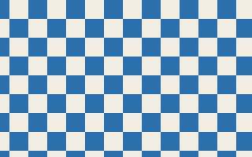

### Circle

Fits a circle inside the image. Foreground, background and edge softness are explicit; a transparent background makes a reusable stamp.

```cpp
cmd.circle(image, {.color = {0.95f, 0.24f, 0.055f, 1}, .background = {0, 0, 0, 0}, .softness = 2});
```

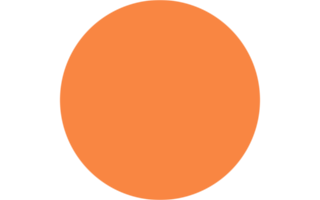

### Dots

Spacing, radius and edge softness use pixels. Offset shifts the repeating pattern.

```cpp
cmd.dots(image, {.spacing = 40, .radius = 10, .color = {0.95f, 0.24f, 0.055f, 1}, .background = {0.88f, 0.85f, 0.77f, 1}, .offset = {0, 0}, .softness = 2});
```

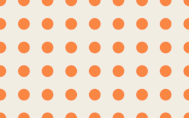

### Fill a color

Fill the entire image with a linear, premultiplied RGBA color. For 50% opaque red use {0.5f, 0, 0, 0.5f}, or `from_srgb(1, 0, 0, 0.5f)` from a color picker's sRGB.

```cpp
cmd.fill(image, {.color = {0.95f, 0.24f, 0.055f, 1}});
```


### Replace with a gradient

Replace writes the ramp including transparent stops. Opacity, mask and region interpolate it with the previous destination. Start and end use image coordinates.

```cpp
const std::array ramp{GradientStop{0, {0.025f, 0.16f, 0.42f, 1}}, GradientStop{1, {0, 0, 0, 0}}};
cmd.gradient_fill(image, {.start = {30, 100}, .end = {290, 100}, .stops = ramp,
    .interpolation = GradientInterpolation::linear, .dither = false, .replace = true});
```


### Grid

Spacing and line width use pixels. The background is written as well as the grid lines.

```cpp
cmd.grid(image, {.spacing = 32, .line_width = 2, .color = {0.025f, 0.16f, 0.42f, 1}, .background = {0.88f, 0.85f, 0.77f, 1}});
```

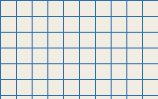

### Noise

A fixed seed produces reproducible noise. Set monochrome to false for independent color channels.

```cpp
cmd.noise(image, {.seed = 42, .monochrome = true});
```

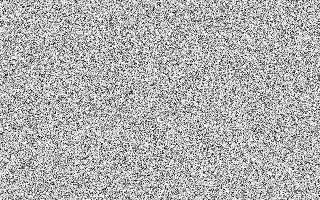

### Perlin noise

Scale controls feature size; octaves add detail. Persistence controls amplitude and lacunarity controls frequency between octaves.

```cpp
cmd.perlin(image, {.scale = 64, .seed = 42, .octaves = 4, .persistence = 0.5f, .lacunarity = 2, .first = {0.025f, 0.16f, 0.42f, 1}, .second = {0.88f, 0.85f, 0.77f, 1}});
```


### Polygon

Choose the side count, rotation in degrees and edge softness in pixels.

```cpp
cmd.polygon(image, {.sides = 6, .color = {0.025f, 0.16f, 0.42f, 1}, .background = {0.88f, 0.85f, 0.77f, 1}, .rotation = 30, .softness = 2});
```

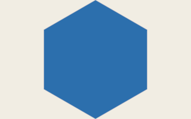

### Stripes

Angle is in degrees; spacing, width and offset are in pixels.

```cpp
cmd.stripes(image, {.angle = 35, .spacing = 40, .width = 16, .first = {0.025f, 0.16f, 0.42f, 1}, .second = {0.88f, 0.85f, 0.77f, 1}});
```


## Color

Point operations on linear colour.

### Brightness

Add an amount to straight linear RGB while preserving alpha. Negative values darken; use exposure for photographic stops.

```cpp
cmd.brightness(image, {.amount = 0.12f});
```

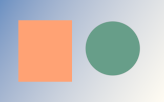

### Contrast

Change contrast around the linear RGB pivot. A factor of 1 leaves the image unchanged; 0 collapses contrast.

```cpp
cmd.contrast(image, {.factor = 1.5f});
```

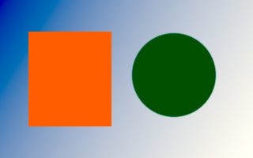

### Exposure

Multiply linear RGB by 2 raised to the number of stops. +1 doubles the light; −1 halves it.

```cpp
cmd.exposure(image, {.stops = 0.75f});
```

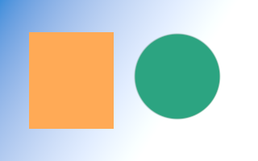

### Gamma

Apply the library’s gamma adjustment to straight RGB. Gamma must be positive; alpha is unchanged.

```cpp
cmd.gamma(image, {.value = 1.8f});
```

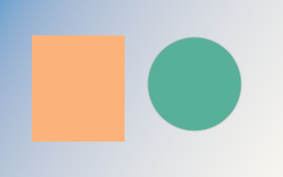

### Grayscale

Convert color to grayscale in place. Alpha is preserved; the library works in linear light.

```cpp
cmd.grayscale(image);
```

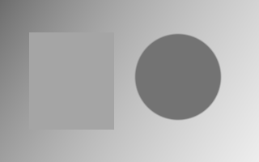

### Hue

Rotate hue by an angle in degrees while preserving alpha.

```cpp
cmd.hue(image, {.degrees = 100});
```

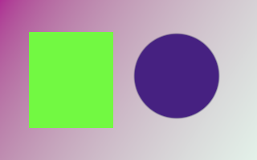

### Invert color

Invert straight RGB and preserve alpha. Mask inversion is shown separately.

```cpp
cmd.invert(image);
```

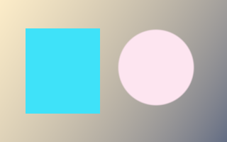

### Opacity

Scale premultiplied RGB and alpha together so translucent colors remain valid.

```cpp
cmd.opacity(image, {.factor = 0.5f});
```


### Saturation

A factor of 0 removes saturation, 1 preserves it, and values above 1 increase it.

```cpp
cmd.saturation(image, {.factor = 0.35f});
```

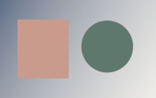

### Sepia

Blend the original colors with a sepia treatment. Intensity controls the effect.

```cpp
cmd.sepia(image, {.intensity = 0.85f});
```

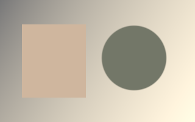

### Solarize

Invert channels above the selected threshold, keeping the remaining values and alpha.

```cpp
cmd.solarize(image, {.value = 0.4f});
```

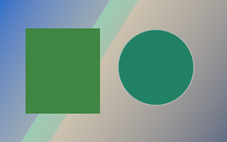

### Threshold

Convert luminance into a two-tone image using a linear threshold; keep alpha.

```cpp
cmd.threshold(image, {.value = 0.25f});
```

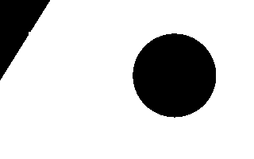

### Vibrance

Adjust color intensity with saturation-dependent weighting. Zero leaves the image unchanged.

```cpp
cmd.vibrance(image, {.amount = 0.65f});
```

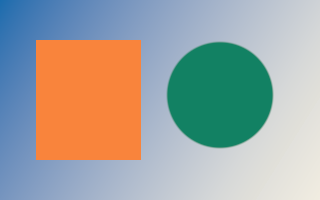

## Adjustments

Photoshop-style adjustments: levels, curves, LUTs and colour grading.

### Black and white

Six hue weights in red/yellow/green/cyan/blue/magenta order use -2..3 for -200%..300%. Optional tint takes its hue and saturation from an opaque linear color.

```cpp
cmd.black_white(image, {.weights = {0.6f, 0.8f, 0.4f, 0.6f, 0.2f, 0.7f}, .tint = true});
```

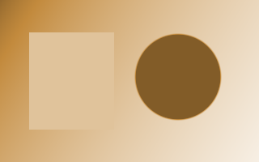

### Channel mixer

Each row contains RGB coefficients and a constant. -2..2 maps to -200%..200%; monochrome uses the red output row for all channels. Mixing occurs in encoded sRGB.

```cpp
cmd.channel_mixer(image, {.red = {0.4f, 0.4f, 0.2f, 0}, .monochrome = true});
```


### Color balance

Cyan/red, magenta/green and yellow/blue controls use -1..1 for -100..100. Localized lightness bands separate shadows, midtones and highlights; correction is bounded to 0.7 encoded units and preserve luminosity restores encoded Rec.709 luma and compresses chroma into the input gamut, including its existing HDR range.

```cpp
cmd.color_balance(image, {.shadows = {-0.2f, 0.02f, 0.25f}, .highlights = {0.2f, 0.05f, -0.1f}});
```

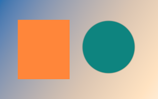

### RGBA color matrix

A row-major 4x5 matrix transforms straight RGBA and adds offsets. Both linear and extended sRGB domains support HDR and negative RGB; alpha is clamped and colors are re-premultiplied.

```cpp
cmd.color_matrix(image, {.matrix = {
    0.8f, 0.15f, 0.05f, 0, 0.02f,
    0.1f, 0.8f, 0.1f, 0, 0,
    0.15f, 0.2f, 0.65f, 0, 0,
    0, 0, 0, 1, 0}});
```

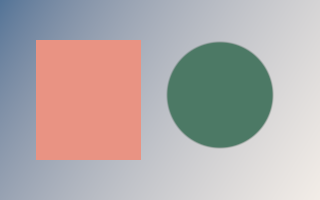

### Curves

Strictly increasing input points define a shape-preserving cubic curve, sampled into a 4096-entry LUT. Points use 0..1 display coordinates; the curve is flat outside the control endpoints within 0..1, with tangent extensions only beyond 0..1. Empty channels are identity.

```cpp
const std::array points{Point{0, 0}, Point{0.25f, 0.12f},
                        Point{0.75f, 0.88f}, Point{1, 1}};
cmd.curves(image, {.composite = points});
```

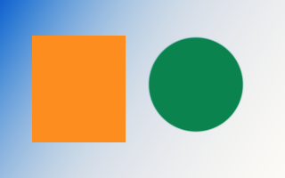

### Gradient map

Encoded RGB is clamped to 0..1; Rec.709 luma indexes ordered stops, with duplicates creating hard edges. Linear input stop colors are interpolated in encoded sRGB, so black-to-white maps preserve gray ramps. Stop alpha multiplies source alpha; use opaque stops for Photoshop-style maps.

```cpp
const std::array stops{GradientStop{0, {0.015f, 0.01f, 0.06f, 1}},
                       GradientStop{0.5f, {0.4f, 0.08f, 0.12f, 1}},
                       GradientStop{0.5f, {0.7f, 0.3f, 0.1f, 1}},
                       GradientStop{1, {1, 0.85f, 0.5f, 1}}};
cmd.gradient_map(image, {.stops = stops, .dither = true});
```

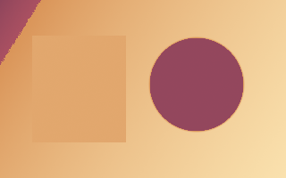

### Hue and saturation

Hue uses -180..180 degrees; saturation and lightness use -1..1 for -100..100. Saturation scales existing chroma continuously. Colorize accepts hue 0..360 and sets absolute HSL saturation in 0..1; active edits retain signed/HDR values using an expanded HSL interval.

```cpp
cmd.hue_saturation(image, {.hue = -25, .saturation = 0.3f, .lightness = 0.05f});
```

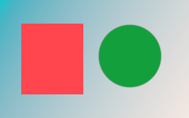

### Levels

Input/output endpoints use 0..1 instead of 0..255. Gamma is the familiar midtone value. Individual channels apply before the composite in signed extended sRGB. SDR input clips at the black/white endpoints; signed-power tails extend only existing negative/HDR input, continuously from 0/1.

```cpp
cmd.levels(image, {.composite = {.input_black = 0.12f, .input_white = 0.92f, .gamma = 1.3f}});
```

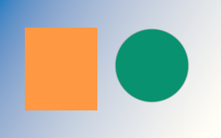

### One-dimensional LUT

Tables sample 0..1 uniformly, interpolate linearly and extrapolate using the endpoint segments; signed/HDR table values are supported. Individual channels apply before the composite; choose encoded sRGB or linear input/output.

```cpp
const std::array red{0.08f, 0.35f, 0.65f, 0.9f, 1.0f};
const std::array blue{0.0f, 0.18f, 0.38f, 0.65f, 0.9f};
cmd.lut(image, {.red = red, .blue = blue});
```

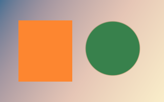

### Three-dimensional LUT

RGB triplets use red-fastest cube order. Trilinear interpolation supports sizes 2..65, signed/HDR outputs and per-channel DOMAIN_MIN/MAX bounds. The consumer parses .cube files; extended sRGB and linear grading are supported.

```cpp
const std::array<float, 24> cube{
    0.03f, 0.01f, 0.08f,  1, 0.05f, 0,
    0.06f, 0.95f, 0.08f,  1, 0.9f, 0.05f,
    0, 0.05f, 0.85f,      0.95f, 0, 0.9f,
    0.05f, 0.9f, 0.9f,    1, 0.96f, 0.85f};
cmd.lut3d(image, {.size = 2, .values = cube,
                  .domain_min = {-0.1f, 0, 0}, .domain_max = {1.1f, 1, 1}});
```

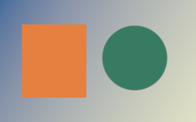

### Photo filter

Density 0..1 maps to 0%..100%. The opaque linear filter color multiplies encoded RGB; preserve luminosity restores luma and compresses chroma into the input gamut, expanded to retain existing signed/HDR values.

```cpp
cmd.photo_filter(image, {.color = {1, 0.35f, 0.06f, 1}, .density = 0.65f});
```

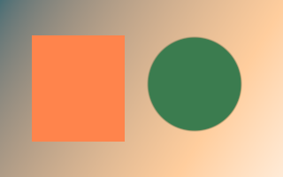

### Posterize

Clamp straight encoded RGB to 0..1 and quantize using 2..256 equal-width input bands and equally spaced output levels, then decode to linear and preserve alpha.

```cpp
cmd.posterize(image, {.levels = 4});
```

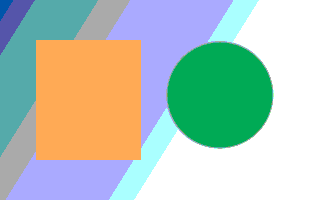

## Filters

Neighbourhood filters: blurs, sharpening, noise reduction and morphology.

### Add noise

Add reproducible uniform or Gaussian noise to straight linear RGB, preserving alpha. HDR and negative values are preserved by default; clip=true explicitly clamps RGB to [0,1]. Amount is percent: uniform half-width or Gaussian standard deviation. Monochromatic shares one sample across channels.

```cpp
cmd.add_noise(image, {.amount = 8, .distribution = NoiseDistribution::gaussian, .monochrome = true, .seed = 42});
```

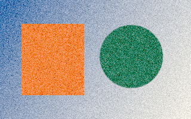

### Box blur

Square box average with clamp edges; radius r uses a (2r+1)-pixel-wide square. Two separable passes reuse an explicitly reserved workspace.

```cpp
auto options = BoxBlurOptions{.radius = 8};
options.workspace = ctx.create_workspace(box_blur_requirements(image.size(), options).workspace);
auto result = ctx.create_image({320, 200});

cmd.box_blur(image, result, options);
```


### Gaussian blur

Radius is in pixels and sigma controls spread. gaussian_blur_requirements gives the workspace plan; the result replaces the input.

```cpp
auto options = GaussianBlurOptions{.radius = 12, .sigma = 4};
options.workspace = ctx.create_workspace(gaussian_blur_requirements(image.size(), options).workspace);

cmd.gaussian_blur(image, options);
```


### High pass

Subtract the Gaussian low frequencies from straight RGB and add neutral gray 0.5 in linear light. Radius is Gaussian sigma; alpha is preserved.

```cpp
auto options = HighPassOptions{.radius = 6};
options.workspace = ctx.create_workspace(high_pass_requirements(image.size(), options).workspace);
auto result = ctx.create_image({320, 200});

cmd.high_pass(image, result, options);
```

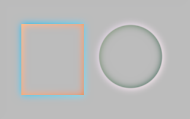

### Maximum

Expand light regions using premultiplied RGBA maxima, including alpha. Reserve the plan returned by maximum_requirements before recording.

```cpp
auto options = MorphologyOptions{.radius = 3, .shape = MorphologyShape::square};
options.workspace = ctx.create_workspace(maximum_requirements(image.size(), options).workspace);
auto result = ctx.create_image({320, 200});

cmd.maximum(image, result, options);
```

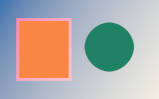

### Median

Exact component-wise median including alpha, radius up to 500. Small radii use sorting networks and large windows use tiled rank queries. median_requirements returns a reusable workspace plan. Reserve it explicitly before recording; small radii need no workspace.

```cpp
auto requirements = median_requirements(image.size(), {.radius = 5});
auto workspace = ctx.create_workspace(requirements.workspace);
auto result = ctx.create_image({320, 200});

cmd.median(image, result, {.radius = 5, .workspace = workspace});
```


### Minimum

Expand dark regions using premultiplied RGBA minima, including alpha. Both shapes support radius 500. Square uses exact line extrema; large round supports approximate a disk with eight line directions.

```cpp
auto options = MorphologyOptions{.radius = 3, .shape = MorphologyShape::round};
options.workspace = ctx.create_workspace(minimum_requirements(image.size(), options).workspace);
auto result = ctx.create_image({320, 200});

cmd.minimum(image, result, options);
```

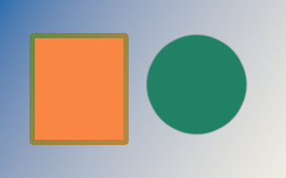

### Motion blur

Centered line exposure: clockwise angle in degrees and distance in pixels. Dense bilinear sampling, accelerated by dyadic line passes above 32 pixels.

```cpp
auto options = MotionBlurOptions{.angle = 30, .distance = 96};
options.workspace = ctx.create_workspace(motion_blur_requirements(image.size(), options).workspace);
auto result = ctx.create_image({320, 200});

cmd.motion_blur(image, result, options);
```

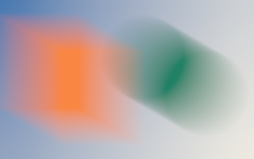

### Pixelate

Mosaic averages premultiplied pixels in cells anchored at the image origin. Partial edge cells use only existing pixels; each cell is averaged once.

```cpp
cmd.pixelate(image, result, {.cell_size = 16});
```

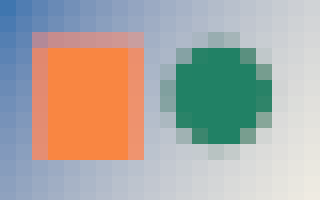

### Radial blur

Spin sweeps an arc measured in degrees. Zoom sweeps inward by amount percent. Center uses continuous image coordinates. Long exposures use bounded rotation or scale passes.

```cpp
auto options = RadialBlurOptions{.center = {160, 100}, .amount = 40, .mode = RadialBlurMode::spin};
options.workspace = ctx.create_workspace(radial_blur_requirements(image.size(), options).workspace);
auto result = ctx.create_image({320, 200});

cmd.radial_blur(image, result, options);
```

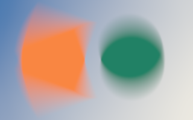

### Sharpen

Neighborhood filters read a distinct source and overwrite the destination. Strength controls edge emphasis.

```cpp
cmd.sharpen(image, result, {.strength = 1.5f});
```

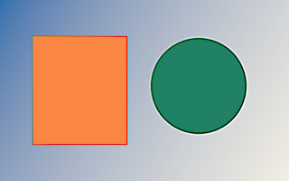

### Surface blur

Bilateral smoothing with spatial sigma radius/2 and range sigma threshold/255 in straight linear RGB. Center alpha is preserved and transparent neighbors do not contribute. Threshold zero is identity. Large radii use multiscale separable bilateral passes.

```cpp
auto options = SurfaceBlurOptions{.radius = 10, .threshold = 30};
options.workspace = ctx.create_workspace(surface_blur_requirements(image.size(), options).workspace);
auto result = ctx.create_image({320, 200});

cmd.surface_blur(image, result, options);
```

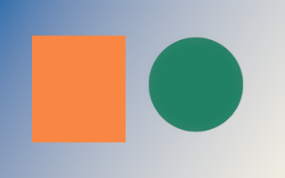

### Unsharp mask

Photoshop-style Amount percent, Gaussian radius in pixels and Threshold levels. Threshold compares sRGB-encoded channel levels; sharpening uses linear RGB; alpha is preserved. No output clipping.

```cpp
auto options = UnsharpMaskOptions{.amount = 150, .radius = 3, .threshold = 2};
options.workspace = ctx.create_workspace(unsharp_mask_requirements(image.size(), options).workspace);
auto result = ctx.create_image({320, 200});

cmd.unsharp_mask(image, result, options);
```

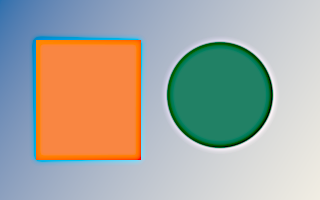

## Effects

Stylised effects built on filters.

### Chroma key

Remove a key color with threshold, transition smoothness and spill suppression. This edits alpha and color, not a separate selection.

```cpp
cmd.fill(image, {.color = {0, 1, 0, 1}});
const std::array points{StrokeSample{{115, 100}}, StrokeSample{{160, 100}}, StrokeSample{{205, 100}}};
cmd.brush_stroke(image, {.samples = points, .brush = {.diameter = 96, .hardness = 0.8f, .spacing = 0}, .color = {0.95f, 0.24f, 0.055f, 1}});
cmd.chroma_key(image, {.key = {0, 1, 0, 1}, .threshold = 0.4f, .smoothness = 0.1f, .spill_suppression = 0.5f});
```

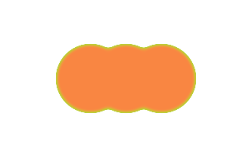

### Drop shadow

drop_shadow_requirements returns output dimensions and a workspace plan with blur padding. expand=false clips the result to the source size.

```cpp
DropShadowOptions options{
    .offset = {12, 10}, .radius = 10, .sigma = 4,
    .color = {0, 0, 0, 0.65f}, .expand = false,
};
const auto required = drop_shadow_requirements(image.size(), options);
options.workspace = ctx.create_workspace(required.workspace);
auto result = ctx.create_image(required.destination);

cmd.circle(image, {.color = {0.95f, 0.24f, 0.055f, 1}, .background = {0, 0, 0, 0}, .softness = 2});
cmd.drop_shadow(image, result, options);
```

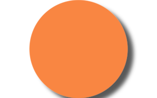

### Emboss

Turn local changes into an embossed relief. Use a separate destination and an explicit strength.

```cpp
cmd.emboss(image, result, {.strength = 1});
```

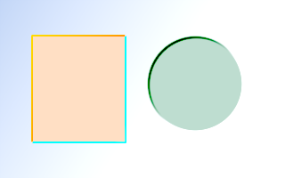

### Rounded corners

Radius is in pixels. The operation attenuates premultiplied RGB and alpha at the corners.

```cpp
cmd.rounded_corners(image, {.radius = 36});
```

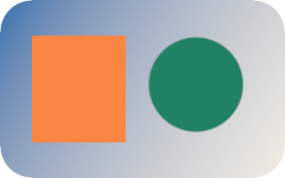

### Sobel edges

Detect local edges in a separate destination image.

```cpp
cmd.sobel(image, result);
```

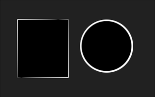

### Vignette

Darken the outer part of an image using normalized radius and softness. The vignette color is premultiplied.

```cpp
cmd.vignette(image, {.radius = 0.5f, .softness = 0.4f, .color = {0, 0, 0, 0.85f}});
```

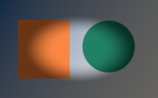

## Transform

Resampling and geometry for images and masks.

### Copy pixels

Copy between equally sized images. An optional coverage mask or destination region limits what is overwritten.

```cpp
cmd.copy(image, result);
```


### Crop

The origin is in source pixels. Destination dimensions define the crop size; no resampling is performed.

```cpp
cmd.crop(image, result, {.origin = {80, 40}});
```

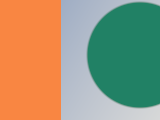

### Flip

Choose horizontal, vertical or both. Read from one image and write to another.

```cpp
cmd.flip(image, result, {.direction = FlipDirection::horizontal});
```

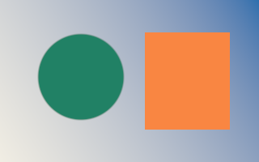

### Move a layer mask with its layer

Masks take the same geometry as images. Apply identical options to a layer and its mask so they stay aligned. Coverage is filtered like alpha and rounded to bytes.

```cpp
cmd.circle(matte, {.color = {1, 1, 1, 1}, .background = {0, 0, 0, 0}, .softness = 6});
cmd.extract_mask(matte, layer_mask, {.mode = MaskMode::alpha});
const TransformOptions move{.matrix = Affine::rotate(15, {160, 100}) * Affine::translate(50, 10),
                            .filter = ResizeFilter::bicubic};
cmd.transform(image, layer, move);
cmd.transform(layer_mask, moved_mask, move);
cmd.fill(result, {.color = {0.88f, 0.85f, 0.77f, 1}});
cmd.copy(layer, result, {.mask = &moved_mask});
```

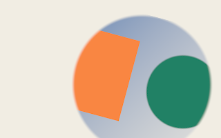

### Resize, crop, flip, rotate and offset masks

Every mask operation mirrors its image counterpart and writes a distinct destination mask; an optional selection mask and region limit which coverage changes. crop, flip, offset and nearest move bytes exactly.

```cpp
cmd.polygon(matte, {.sides = 3, .color = {1, 1, 1, 1}, .background = {0, 0, 0, 0}, .rotation = 0, .softness = 1});
cmd.extract_mask(matte, shape, {.mode = MaskMode::alpha});
cmd.zoom(shape, zoomed, {.factor = 1.1f, .center = {160, 100}});
cmd.copy(zoomed, shape);
cmd.resize(shape, small, {.filter = ResizeFilter::area});           // 160x100 triangle.
cmd.crop(small, placed, {.origin = {-10, -10}});                     // Placed at (10, 10).
cmd.flip(placed, mirrored, {.direction = FlipDirection::horizontal});
cmd.rotate(placed, turned, {.degrees = 180});                        // About the center.
cmd.offset(turned, lowered, {.offset = {-150, 0}, .edge = EdgeMode::transparent});
const std::array corners{Point{120, 40}, Point{200, 40}, Point{230, 190}, Point{90, 190}};
cmd.perspective(small, tilted, {.corners = corners});
cmd.fill(image, {.color = {0.88f, 0.85f, 0.77f, 1}});
cmd.fill(image, {.color = {0.025f, 0.16f, 0.42f, 1}, .mask = &placed});
cmd.fill(image, {.color = {0.95f, 0.24f, 0.055f, 1}, .mask = &mirrored});
cmd.fill(image, {.color = {0.015f, 0.22f, 0.13f, 1}, .mask = &lowered});
cmd.fill(image, {.color = {0, 0, 0, 0.6f}, .mask = &tilted});
```

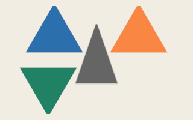

### Offset and wrap around

Photoshop Filter › Other › Offset moves by whole pixels. EdgeMode::repeat wraps around, useful to check seamless tiles; clamp repeats edge pixels, transparent clears and mirror reflects.

```cpp
cmd.offset(image, result, {.offset = {160, 100}, .edge = EdgeMode::repeat});
```

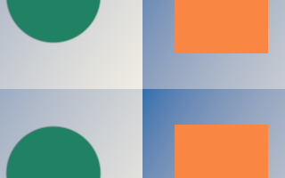

### Perspective and distort

Photoshop Distort/Perspective: the destination positions of the source corners, in the order top-left, top-right, bottom-right, bottom-left, forming a convex quadrilateral. perspective_matrix returns the same homography for overlays and hit testing. The far side is filtered over its footprint, not point sampled. Steep foreshortening samples a box pyramid in a workspace sized by perspective_requirements.

```cpp
const std::array corners{Point{95, 25}, Point{245, 10}, Point{315, 190}, Point{5, 175}};
cmd.perspective(image, result, {.corners = corners, .filter = ResizeFilter::bilinear});
```


### Pixelate

A recipe made from two resizes: reduce detail, then enlarge with nearest-neighbor sampling. Use pixelate for exact cell averages.

```cpp
cmd.resize(image, small, {.filter = ResizeFilter::bilinear});
cmd.resize(small, image, {.filter = ResizeFilter::nearest});
```


### Compose projective transforms

Homography matrices map continuous source points to destination points. Compose a perspective with an affine placement, then apply the same matrix to images and layer masks.

```cpp
const Homography perspective{{1, 0, 0, 0, 1, 0, 0.002, 0, 1}};
const ProjectiveTransformOptions options{.matrix = Homography::from(Affine::translate(40, 20)) * perspective};
cmd.transform(image, result, options);
cmd.select_ellipse(selection, {.origin = {20, 10}, .width = 280, .height = 180});
cmd.transform(selection, transformed, options);
cmd.apply_mask(transformed, result);
```


### Resize

Destination dimensions set the output size. Filters: nearest, bilinear, bicubic, lanczos and area; reductions average instead of aliasing. Source and destination must be distinct. Very large reductions run one pass per axis through a workspace sized by resize_requirements.

```cpp
cmd.resize(image, result, {.filter = ResizeFilter::bilinear});
```


### Reduce without moiré

When the destination is smaller, bilinear, bicubic and lanczos widen with the reduction factor and area averages the exact pixel coverage, so fine detail becomes its average instead of moiré. nearest always point-samples.

```cpp
cmd.stripes(image, {.angle = 20, .spacing = 3, .width = 1.5f, .first = {0.025f, 0.16f, 0.42f, 1}, .second = {0.88f, 0.85f, 0.77f, 1}});
cmd.resize(image, result, {.filter = ResizeFilter::area});
```


### Rotate

Angle is in degrees. Rotation uses the image centers; uncovered pixels are transparent. Choose the destination size explicitly.

```cpp
cmd.rotate(image, result, {.degrees = 25, .filter = ResizeFilter::bicubic});
```


### Free transform

Photoshop Free Transform. The Affine maps source to destination pixels; positive degrees turn clockwise and the right operand applies first. transform_bounds gives the pixel rectangle the result covers: allocate it and translate by its origin. Reductions average each pixel’s footprint instead of aliasing; outside the source is transparent unless another EdgeMode (clamp, repeat, mirror) is chosen. Large reductions sample an area table, reduced source or pyramid in a workspace sized by transform_requirements.

```cpp
const Affine matrix = Affine::rotate(-20) * Affine::scale(0.75f, 0.5f);
const Rect bounds = transform_bounds({0, 0, 320, 200}, matrix);
auto result = ctx.create_image(ImageSize{bounds.width, bounds.height});

cmd.transform(image, result, {.matrix = Affine::translate(-bounds.x, -bounds.y) * matrix, .filter = ResizeFilter::bicubic});
```


### Zoom

Scale around a center expressed in source pixels. Unlike resize, the destination can keep the original dimensions.

```cpp
cmd.zoom(image, result, {.factor = 1.6f, .center = {160, 100}, .filter = ResizeFilter::lanczos});
```


## Select

Build and refine selections, which are masks.

### Border

Select > Modify > Border: an anti-aliased band of the given total width centered on the selection edge.

```cpp
// Selections are A8 masks owned by the context; destroy them like images.
auto selection = ctx.create_mask(image.size());
auto workspace = ctx.create_workspace(border_requirements(image.size(), {.width = 16}).workspace);

cmd.select_ellipse(selection, {.origin = {70, 30}, .width = 180, .height = 140});
cmd.border(selection, {.width = 16, .workspace = workspace});
cmd.fill(image, {.color = {0.9f, 0.9f, 0.85f, 1}, .mask = &selection});
```


### Combine selections

Merge a saved selection or channel into another mask with a selection mode, like Load Selection.

```cpp
// Selections are A8 masks owned by the context; destroy them like images.
auto selection = ctx.create_mask(image.size());
auto saved = ctx.create_mask(image.size());

cmd.select_rectangle(selection, {.origin = {40, 40}, .width = 240, .height = 120});
cmd.select_ellipse(saved, {.origin = {100, 20}, .width = 120, .height = 160});
cmd.combine(saved, selection, {.mode = SelectionMode::subtract});
cmd.fill(image, {.color = {0.9f, 0.9f, 0.85f, 1}, .mask = &selection});
```


### Expand and contract

Select > Modify > Expand and Contract use exact Euclidean distances, so corners round and edges stay anti-aliased. Expand never removes and contract never adds coverage.

```cpp
// Selections are A8 masks owned by the context; destroy them like images.
auto selection = ctx.create_mask(image.size());
auto workspace = ctx.create_workspace(expand_requirements(image.size(), {.radius = 24}).workspace);

const std::array stroke{Point{40, 150}, Point{120, 40}, Point{190, 150}, Point{280, 50}};
cmd.select_polygon(selection, {.points = stroke});
cmd.expand(selection, {.radius = 14, .workspace = workspace});
cmd.fill(image, {.color = {0.9f, 0.9f, 0.85f, 1}, .mask = &selection});
cmd.contract(selection, {.radius = 24, .workspace = workspace});
cmd.fill(image, {.color = {0.6f, 0.05f, 0.05f, 1}, .mask = &selection});
```


### Feather

Select > Modify > Feather: a Gaussian blur of the selection; radius is the standard deviation in pixels. canvas_bounds treats the outside of the canvas as unselected.

```cpp
// Selections are A8 masks owned by the context; destroy them like images.
auto selection = ctx.create_mask(image.size());
auto workspace = ctx.create_workspace(feather_requirements(image.size(), {.radius = 12}).workspace);

cmd.select_rectangle(selection, {.origin = {60, 40}, .width = 200, .height = 120});
cmd.feather(selection, {.radius = 12, .workspace = workspace});
cmd.fill(image, {.color = {0.9f, 0.9f, 0.85f, 1}, .mask = &selection});
```


### Edit mask coverage locally

Mask copy, fill, invert, levels, threshold and combine accept a write mask and a clipped region. The selection blends old and computed coverage; untouched bytes keep their original values.

```cpp
cmd.select_ellipse(selection, {.origin = {30, 20}, .width = 260, .height = 160});
cmd.fill(control, {.coverage = 0.5f});
cmd.copy(selection, edited, {.region = Rect{0, 0, 200, 200}});
cmd.invert(edited, {.mask = &control, .region = Rect{140, 0, 180, 200}});
cmd.levels(edited, {.transfer = {.gamma = 1.8f}, .region = Rect{0, 0, 160, 200}});
cmd.threshold(edited, {.value = 0.4f, .region = Rect{0, 100, 320, 100}});
cmd.combine(selection, edited, {.mode = SelectionMode::intersect, .region = Rect{160, 0, 160, 200}});
cmd.apply_mask(edited, image);
```


### Threshold and levels

Remap selection coverage like Levels in Quick Mask; threshold makes a hard selection. Values are coverage in [0, 1].

```cpp
// Selections are A8 masks owned by the context; destroy them like images.
auto selection = ctx.create_mask(image.size());
auto workspace = ctx.create_workspace(feather_requirements(image.size(), {.radius = 30}).workspace);

cmd.select_ellipse(selection, {.origin = {40, 20}, .width = 240, .height = 160});
cmd.feather(selection, {.radius = 30, .workspace = workspace});
cmd.levels(selection, {.transfer = {.input_black = 0.3f, .input_white = 0.9f, .gamma = 1.5f}});
cmd.fill(image, {.color = {0.9f, 0.9f, 0.85f, 1}, .mask = &selection});
cmd.threshold(selection, {.value = 0.95f});
cmd.fill(image, {.color = {0.6f, 0.05f, 0.05f, 1}, .mask = &selection});
```


### Transfer a mask patch

A8 transfers use tightly packed coverage bytes. Explicit buffer capacity and TransferOptions let undo patches and tiles transfer just their rectangle, including unaligned byte offsets.

```cpp
auto selection = ctx.create_mask(image.size());
auto patch_upload = ctx.create_upload_buffer(selection, {.capacity_pixels = 95 * 80});
auto saved = ctx.create_readback_buffer(selection, {.capacity_pixels = 95 * 80});
std::array<std::uint8_t, 95 * 80> coverage{};
coverage.fill(255);
ctx.write(patch_upload, coverage);

cmd.fill(selection, {.coverage = 0.2f});
cmd.upload(patch_upload, selection, {.region = Rect{73, 45, 95, 80}});
cmd.download(selection, saved, {.region = Rect{73, 45, 95, 80}});
cmd.apply_mask(selection, image);
```


### Color range

Select > Color Range: coverage falls linearly with straight sRGB distance normalized by the RGB cube diagonal from the color, reaching zero at fuzziness, and scales with pixel alpha. The color is linear premultiplied like pixels.

```cpp
// Selections are A8 masks owned by the context; destroy them like images.
auto selection = ctx.create_mask(image.size());

cmd.select_color_range(image, selection, {.color = {0.95f, 0.24f, 0.055f, 1}, .fuzziness = 80.0f / (255.0f * 1.7320508f)});
cmd.invert(selection);
cmd.grayscale(image, {.mask = &selection});
```


### Elliptical marquee and modes

Modes match Photoshop: replace, add, subtract, intersect and difference, applied exactly to coverage bytes. transform rotates or skews any marquee (Transform Selection).

```cpp
// Selections are A8 masks owned by the context; destroy them like images.
auto selection = ctx.create_mask(image.size());

cmd.select_ellipse(selection, {.origin = {30, 40}, .width = 150, .height = 120});
cmd.select_ellipse(selection, {.origin = {120, 40}, .width = 150, .height = 120,
                               .transform = Affine::rotate(30, {195, 100}), .mode = SelectionMode::difference});
cmd.fill(image, {.color = {0.9f, 0.9f, 0.85f, 1}, .mask = &selection});
```


### Magic wand

Contiguous selection by normalized per-channel tolerance in [0,1] on rounded sRGB and alpha, exact in one submission (union-find, no readback). Turn contiguous off to select every matching pixel; sample_radius averages the reference; anti_alias softens edges.

```cpp
// Selections are A8 masks owned by the context; destroy them like images.
auto selection = ctx.create_mask(image.size());
auto workspace = ctx.create_workspace(select_magic_wand_requirements(image.size(), {}).workspace);

cmd.select_magic_wand(image, selection, {.seed = {80, 100}, .tolerance = 40.0f / 255.0f, .sample_radius = 1, .workspace = workspace});
cmd.fill(image, {.color = {0.9f, 0.9f, 0.85f, 1}, .mask = &selection});
```


### Lasso and feather

Points are closed contours (Lasso, Polygonal Lasso). Fill rules: nonzero or even_odd, which leaves this star’s center unselected. feather blurs the new shape in pixels, using a workspace sized by feather_requirements.

```cpp
// Selections are A8 masks owned by the context; destroy them like images.
auto selection = ctx.create_mask(image.size());
auto workspace = ctx.create_workspace(feather_requirements(image.size(), {.radius = 3}).workspace);

const std::array star{Point{160, 12}, Point{215, 185}, Point{68, 78}, Point{252, 78}, Point{105, 185}};
cmd.select_polygon(selection, {.points = star, .rule = FillRule::even_odd, .feather = 3, .workspace = workspace});
cmd.fill(image, {.color = {0.9f, 0.9f, 0.85f, 1}, .mask = &selection});
```


### Rectangular marquee

Selections are A8 masks. Coordinates are continuous pixels: edges get exact area coverage, and corner_radius rounds the corners. Fill through the mask to see it; the selection limits any masked operation.

```cpp
// Selections are A8 masks owned by the context; destroy them like images.
auto selection = ctx.create_mask(image.size());

cmd.select_rectangle(selection, {.origin = {40.5f, 30.25f}, .width = 170, .height = 120, .corner_radius = 28});
cmd.fill(image, {.color = {0.9f, 0.9f, 0.85f, 1}, .mask = &selection});
```


### Smooth

Select > Modify > Smooth: majority vote over a square of the given radius removes specks and rounds jagged steps.

```cpp
// Selections are A8 masks owned by the context; destroy them like images.
auto selection = ctx.create_mask(image.size());
auto workspace = ctx.create_workspace(smooth_requirements(image.size(), {.radius = 8}).workspace);

cmd.select_color_range(image, selection, {.color = {0.95f, 0.24f, 0.055f, 1}, .fuzziness = 60.0f / (255.0f * 1.7320508f)});
cmd.smooth(selection, {.radius = 8, .workspace = workspace});
cmd.fill(image, {.color = {0.9f, 0.9f, 0.85f, 1}, .mask = &selection});
```


## Compose

Blend layers: modes, layer masks, alpha lock, Blend If and clipping groups.

### Apply a layer mask

Multiply premultiplied destination RGBA by A8 coverage. Position places the mask in destination coordinates; pixels outside it stay unchanged.

```cpp
cmd.circle(matte, {.color = {1, 1, 1, 1}, .background = {0, 0, 0, 0}, .softness = 8});
cmd.extract_mask(matte, coverage, {.mode = MaskMode::alpha});
cmd.apply_mask(coverage, image);
```


### Blend a layer

Position uses destination pixels. All 28 modes are available; see Photoshop blend modes below. Opacity multiplies source coverage.

```cpp
cmd.circle(layer, {.color = {0.95f, 0.24f, 0.055f, 1}, .background = {0, 0, 0, 0}, .softness = 2});
cmd.blend(layer, image, {.position = {110, 45}, .opacity = 0.9f, .mode = BlendMode::screen});
```


### Blend If with split sliders

With srgb encoding, 0.30/0.65 fades away this layer over dark underlying pixels. Divide sRGB-document 0–255 UI values by 255. The default encoding is linear. Source and destination ranges multiply source coverage before compositing.

```cpp
cmd.fill(layer, {.color = {0.95f, 0.24f, 0.055f, 1}});
cmd.blend(layer, image, {.opacity = 0.85f, .blend_if = BlendIfOptions{
    .destination = {.black = 0.30f, .black_split = 0.65f}, .encoding = ColorEncoding::srgb}});
```


### Blend several layers

Layers are applied in array order. Batch consecutive pixel layers; keep adjustments and nested-document composition in your application.

```cpp
cmd.circle(first, {.color = {0.95f, 0.24f, 0.055f, 1}, .background = {0, 0, 0, 0}, .softness = 2});
cmd.polygon(second, {.sides = 5, .color = {0.025f, 0.16f, 0.42f, 1}, .background = {0, 0, 0, 0}, .rotation = 0, .softness = 2});
const std::array sources{first, second};
const std::array positions{Position{60, 45}, Position{145, 45}};
const std::array opacities{0.85f, 0.9f};
const std::array modes{BlendMode::normal, BlendMode::multiply};
cmd.blend_many(sources, image, {.positions = positions, .opacities = opacities, .modes = modes});
```


### Photoshop blend modes

All 28 modes blend straight linear colors with source-over alpha. Here: hue, color dodge, vivid light and luminosity. Linear dodge saturates at the greater of one and the backdrop; add is unrestricted. Non-separable modes use W3C Lum/Sat/ClipColor.

```cpp
{
const std::array ramp{GradientStop{0, {0.8f, 0.02f, 0.1f, 1}}, GradientStop{1, {0.02f, 0.7f, 0.6f, 1}}};
cmd.gradient_fill(layer, {.start = {0, 0}, .end = {320, 200}, .stops = ramp,
    .interpolation = GradientInterpolation::linear, .dither = false, .replace = true});
}
const std::array sources{layer, layer, layer, layer};
const std::array positions{Position{0, 0}, Position{80, 0}, Position{160, 0}, Position{240, 0}};
const std::array modes{BlendMode::hue, BlendMode::color_dodge, BlendMode::vivid_light, BlendMode::luminosity};
cmd.blend_many(sources, image, {.positions = positions, .modes = modes});
```


### Clipping group and alpha lock

Copy the base into an isolated group, then use preserve_alpha on each clipped layer. The base alpha stays fixed, even at soft edges. Composite the completed group onto the document. Keep the isolated base separate from the document backdrop.

```cpp
cmd.circle(base, {.color = {0.95f, 0.24f, 0.055f, 1}, .background = {0, 0, 0, 0}, .softness = 15});
cmd.copy(base, group);
cmd.stripes(layer, {.angle = 30, .spacing = 24, .width = 10, .first = {0.025f, 0.16f, 0.42f, 1}, .second = {0, 0, 0, 0}});
const std::array sources{layer};
const std::array positions{Position{}};
const std::array layers{BlendLayerOptions{.preserve_alpha = true}};
cmd.blend_many(sources, group, {.positions = positions, .layers = layers});
cmd.blend(group, image, {.position = {70, 10}});
```


### Seeded dissolve

Dissolve makes binary source-alpha decisions. Omitted seeds use source identity and dissolve order within a Commands recording, keeping the same stack stable on rerender. Set explicit per-layer seeds to preserve patterns across resource recreation or reordering. Its pattern uses source coordinates and moves with the layer. Destination coverage masks still soften the final write.

```cpp
cmd.circle(layer, {.color = {0.95f, 0.24f, 0.055f, 1}, .background = {0, 0, 0, 0}, .softness = 12});
cmd.blend(layer, image, {.position = {70, 10}, .opacity = 0.45f, .mode = BlendMode::dissolve, .seed = 42});
```


### A mask that moves with the layer

source_mask uses source coordinates and must match the layer size. The existing mask and region use destination coordinates. This circular source mask moves with each differently positioned layer.

```cpp
auto layerMask = ctx.create_mask({120, 120});
auto shape = ctx.create_image({120, 120});
auto layer = ctx.create_image({120, 120});

cmd.circle(shape, {.color = {1, 1, 1, 1}, .background = {0, 0, 0, 0}, .softness = 10});
cmd.extract_mask(shape, layerMask, {.mode = MaskMode::alpha});
{
const std::array ramp{GradientStop{0, {0.95f, 0.24f, 0.055f, 1}}, GradientStop{1, {0.025f, 0.16f, 0.42f, 1}}};
cmd.gradient_fill(layer, {.start = {0, 0}, .end = {320, 200}, .stops = ramp,
    .interpolation = GradientInterpolation::linear, .dither = false, .replace = true});
}
cmd.blend(layer, image, {.position = {30, 30}, .source_mask = &layerMask});
cmd.blend(layer, image, {.position = {170, 65}, .mode = BlendMode::screen, .source_mask = &layerMask});
```


## Paint

The brush engine and the tools built on it.

### Brush tool

Samples are pointer events: image position, pressure, tilt and rotation. The engine places dabs every spacing × diameter along the path; minimum_size, minimum_opacity and minimum_flow map pressure like Photoshop’s Pen Pressure controls. Opacity caps the whole stroke, flow sets how fast overlapping dabs build up. brush_dabs and stroke_bounds return the dabs and the dirty rectangle for history. Set brush.tip to a Mask for sampled tips.

```cpp
const std::array samples{StrokeSample{{40, 160}, 0.15f}, StrokeSample{{110, 60}, 0.8f},
                         StrokeSample{{190, 150}, 1.0f}, StrokeSample{{285, 45}, 0.3f}};
const Brush brush{.diameter = 34, .hardness = 0.7f, .spacing = 0.08f, .minimum_size = 0.15f};
cmd.brush_stroke(image, {.samples = samples, .brush = brush, .color = {0.9f, 0.86f, 0.78f, 1},
                         .opacity = 0.9f, .flow = 0.6f});
```


### Fill a contiguous selection

Set match_seed to false to fill exactly through a wand selection, including its antialiased edge. Seed, tolerance and softness are then ignored.

```cpp
auto selection = ctx.create_mask(image.size());
auto workspace = ctx.create_workspace(select_magic_wand_requirements(image.size(), {}).workspace);

cmd.select_magic_wand(image, selection, {.seed = {80, 100}, .tolerance = 40.0f / 255.0f, .workspace = workspace});
cmd.paint_bucket(image, {.color = {0.95f, 0.24f, 0.055f, 1}, .match_seed = false, .mask = &selection});
```


### Clone stamp

Paints source pixels found at destination − offset; the offset is the destination minus the Alt-clicked source point. Keep one offset for Aligned, recompute it per stroke otherwise. Clone within one layer from a copy.

```cpp
cmd.copy(image, source);
const std::array samples{StrokeSample{{225, 60}}, StrokeSample{{225, 170}}};
cmd.clone_stroke(source, image, {.samples = samples, .brush = {.diameter = 70, .hardness = 0.5f},
                                 .offset = {140, 0}});
```


### Dodge and burn

Photoshop Range (shadows, midtones, highlights) and Exposure. Exposure caps the stroke like an opacity. Protect Tones moves luminance and keeps hue.

```cpp
const std::array top{StrokeSample{{20, 60}}, StrokeSample{{300, 60}}};
const std::array bottom{StrokeSample{{20, 150}}, StrokeSample{{300, 150}}};
const Brush brush{.diameter = 60, .hardness = 0};
cmd.dodge_burn_stroke(image, {.samples = top, .brush = brush, .range = ToneRange::midtones, .exposure = 0.8f});
cmd.dodge_burn_stroke(image, {.samples = bottom, .brush = brush, .burn = true, .range = ToneRange::midtones, .exposure = 0.8f});
```


### Continue erasing

Keep an eraser stroke’s opacity cap across calls with a BrushStrokeState.

```cpp
auto state = ctx.create_brush_stroke_state(image);

const std::array first{StrokeSample{{30, 100}}, StrokeSample{{155, 60}}};
const std::array next{StrokeSample{{290, 120}}};
cmd.eraser_stroke(image, state, {.samples = first, .brush = {.diameter = 42}, .opacity = 0.7f});
cmd.eraser_stroke(image, state, {.samples = next, .brush = {.diameter = 42}, .opacity = 0.7f});
```


### Eraser tool

Scales color and alpha toward transparency with the same brush engine, opacity cap and flow. Save as PNG to see the transparent result.

```cpp
const std::array samples{StrokeSample{{30, 100}}, StrokeSample{{160, 60}}, StrokeSample{{290, 110}}};
cmd.eraser_stroke(image, {.samples = samples, .brush = {.diameter = 46, .hardness = 0.3f}, .opacity = 0.85f});
```


### Blur and sharpen tools

Mixes toward a 5×5 blur, or away from it for sharpen, by the stroke coverage; strength caps it. The operation copies the stroke area into a workspace plane reserved before recording.

```cpp
auto workspace = ctx.create_workspace(focus_stroke_requirements(image.size()).workspace);

const std::array samples{StrokeSample{{50, 40}}, StrokeSample{{140, 160}}, StrokeSample{{280, 80}}};
cmd.focus_stroke(image, {.samples = samples, .brush = {.diameter = 44, .hardness = 0.4f}, .strength = 1, .workspace = workspace});
```


### Gradient tool

Drag from start to end. Shapes: linear, radial, angle, reflected and diamond; stops are premultiplied linear colors at nondecreasing positions. Perceptual interpolation mixes sRGB-encoded colors like Photoshop; dither prevents banding in 8-bit output. extend clamps, repeats, mirrors or leaves pixels unchanged.

```cpp
const std::array stops{GradientStop{0, {0.025f, 0.16f, 0.42f, 1}}, GradientStop{0.55f, {0.88f, 0.85f, 0.77f, 1}},
                       GradientStop{0.55f, {0.4f, 0.1f, 0.02f, 0.8f}}, GradientStop{1, {0.95f, 0.24f, 0.055f, 1}}};
cmd.gradient_fill(image, {.start = {160, 100}, .end = {290, 60}, .stops = stops,
                          .shape = GradientShape::angle, .dither = true});
```


### Paint a layer mask

Brush coverage paints toward a mask value; the eraser paints toward zero. Opacity, flow, tips, selection and region work on A8 masks. The result below reveals the painted mask as a color.

```cpp
auto selection = ctx.create_mask(image.size());

cmd.fill(selection, {.coverage = 0});
const std::array stroke{StrokeSample{{40, 150}}, StrokeSample{{160, 40}}, StrokeSample{{280, 150}}};
cmd.brush_stroke(selection, {.samples = stroke, .brush = {.diameter = 45, .hardness = 0.6f}, .coverage = 1});
const std::array cut{StrokeSample{{160, 30}}, StrokeSample{{160, 170}}};
cmd.eraser_stroke(selection, {.samples = cut, .brush = {.diameter = 25}, .opacity = 0.8f});
cmd.fill(image, {.color = {0.95f, 0.24f, 0.055f, 1}, .mask = &selection});
```


### Continue mask strokes

Each state represents one stroke. Mask continuation replays before A8 rounding, so segment boundaries cannot accumulate rounding errors.

```cpp
auto selection = ctx.create_mask(image.size());
auto paint = ctx.create_brush_stroke_state(selection);
auto erase = ctx.create_brush_stroke_state(selection);

cmd.fill(selection, {.coverage = 0});
const std::array first{StrokeSample{{35, 140}}, StrokeSample{{145, 50}}};
const std::array next{StrokeSample{{285, 150}}};
const Brush brush{.diameter = 45, .hardness = 0.6f};
cmd.brush_stroke(selection, paint, {.samples = first, .brush = brush, .coverage = 1, .opacity = 0.8f});
cmd.brush_stroke(selection, paint, {.samples = next, .brush = brush, .coverage = 1, .opacity = 0.8f});
cmd.eraser_stroke(selection, erase, {.samples = first, .brush = {.diameter = 15}, .opacity = 0.5f});
cmd.eraser_stroke(selection, erase, {.samples = next, .brush = {.diameter = 15}, .opacity = 0.5f});
cmd.fill(image, {.color = {0.95f, 0.24f, 0.055f, 1}, .mask = &selection});
```


### Paint bucket

Fills every pixel within tolerance of the seed pixel’s original color; 32/255 matches Photoshop’s default. This is non-contiguous; for Contiguous pass a flood-fill selection mask and set match_seed to false.

```cpp
cmd.paint_bucket(image, {.seed = {80, 100}, .tolerance = 0.2f, .softness = 0.05f, .color = {0.025f, 0.16f, 0.42f, 1}});
```


### Lock transparent pixels

preserve_alpha changes color while retaining destination alpha. Transparent pixels stay transparent. Brush, clone, pattern, gradient, bucket, focus and smudge tools support it.

```cpp
cmd.circle(image, {.color = {0.025f, 0.16f, 0.42f, 1}, .background = {0, 0, 0, 0}, .softness = 20});
const std::array stroke{StrokeSample{{20, 120}}, StrokeSample{{300, 50}}};
cmd.brush_stroke(image, {.samples = stroke, .brush = {.diameter = 55}, .color = {0.95f, 0.24f, 0.055f, 1}, .preserve_alpha = true});
```


### Pattern fill

Tiles a pattern image over the destination through an Affine (pattern to image), with bilinear filtering, a blend mode and opacity.

```cpp
cmd.stripes(tile, {.angle = 0, .spacing = 12, .width = 5, .first = {0.95f, 0.24f, 0.055f, 1}, .second = {0, 0, 0, 0}});
cmd.pattern_fill(tile, image, {.transform = Affine::rotate(30) * Affine::scale(1.5f), .mode = BlendMode::multiply, .opacity = 0.8f});
```


### Pattern stamp

Paints a tiled pattern through an Affine that maps pattern to image coordinates. Aligned keeps one transform; non-aligned translates it to each stroke’s start.

```cpp
cmd.checkerboard(tile, {.size = 8, .first = {0.025f, 0.16f, 0.42f, 1}, .second = {0.88f, 0.85f, 0.77f, 1}});
const std::array samples{StrokeSample{{40, 150}}, StrokeSample{{160, 40}}, StrokeSample{{280, 150}}};
cmd.pattern_stroke(tile, image, {.samples = samples, .brush = {.diameter = 40, .hardness = 0.8f},
                                 .transform = Affine::rotate(45), .opacity = 0.9f});
```


### Limit an edit to a rectangle

Regions use destination coordinates. An optional A8 coverage mask can further restrict the effect; initialize out-of-place destinations before masked operations.

```cpp
Rect area{40, 30, 150, 120};
cmd.grayscale(image, {.region = area});
```


### Continue smudging

SmudgeStrokeState preserves the complete stroke result, including pigment transport. Reserve the state snapshot and the transient workspace before recording. Reset keeps the snapshot capacity for the next stroke.

```cpp
const Brush brush{.diameter = 45, .hardness = 0.5f};
auto state = ctx.create_smudge_stroke_state(image);
auto workspace = ctx.create_workspace(smudge_stroke_requirements(image.size(), {.brush = brush}).workspace);

const std::array first{StrokeSample{{70, 100}}, StrokeSample{{150, 70}}};
const std::array next{StrokeSample{{270, 140}}};
cmd.smudge_stroke(image, state, {.samples = first, .brush = brush, .strength = 0.9f, .workspace = workspace});
cmd.smudge_stroke(image, state, {.samples = next, .brush = brush, .strength = 0.9f, .workspace = workspace});
```


### Smudge

Dabs run in order: the first picks up the pixels under it and every later dab mixes what it carries with the image before depositing it. Strength 1 drags the first colors along the whole stroke. smudge_stroke_requirements reports the workspace capacity for the carried patch.

```cpp
const Brush brush{.diameter = 44, .hardness = 0.5f, .spacing = 0.05f};
auto workspace = ctx.create_workspace(smudge_stroke_requirements(image.size(), {.brush = brush}).workspace);

const std::array samples{StrokeSample{{80, 100}}, StrokeSample{{150, 90}}, StrokeSample{{240, 130}}};
cmd.smudge_stroke(image, {.samples = samples, .brush = brush, .strength = 0.85f, .workspace = workspace});
```


### Sponge

Desaturates toward linear luminance or saturates away from it. Flow builds the effect up; vibrance protects already saturated colors.

```cpp
const std::array samples{StrokeSample{{40, 100}}, StrokeSample{{280, 100}}};
cmd.sponge_stroke(image, {.samples = samples, .brush = {.diameter = 90, .hardness = 0.2f}, .flow = 0.9f});
```


### Continue a stroke

Reserve the snapshot explicitly, then pass only new samples to the same move-only state. reset() starts another stroke without reallocating the snapshot. It retains the original pixels and accumulated events, replaying them exactly so spacing, random dabs and opacity agree with one call. Keep options and selection fixed. Replay costs grow with the whole stroke.

Brush, eraser (including A8 masks) and smudge capture only new strips as the stroke
bounds grow, then restore the previous bounds before replay. Snapshot copies touch
at most the accumulated rectangle's area per call, clipped to the canvas and region.
The full-size storage is still reserved at creation (384 MB for a 24 MP image,
24 MB for a mask), counted in the image/mask memory ledger, and reused by reset.
`snapshot_bounds()` exposes the conservative recorded rectangle; snapshot pixels
remain private, so exporting them as an undo step is a follow-up.

```cpp
auto state = ctx.create_brush_stroke_state(image);

const Brush brush{.diameter = 35, .hardness = 0.6f, .spacing = 0.08f, .size_jitter = 0.3f, .seed = 17};
const std::array first{StrokeSample{{30, 140}}, StrokeSample{{130, 60}}};
const std::array next{StrokeSample{{215, 150}}, StrokeSample{{290, 50}}};
cmd.brush_stroke(image, state, {.samples = first, .brush = brush, .color = {0.95f, 0.24f, 0.055f, 1}, .opacity = 0.7f});
cmd.brush_stroke(image, state, {.samples = next, .brush = brush, .color = {0.95f, 0.24f, 0.055f, 1}, .opacity = 0.7f});
const auto dirty = state.snapshot_bounds(); // optional<Rect>; recording is not completion
```


## Display

### Update a zoomed-out viewport after a local edit

Reserve the viewport once, then submit edits before drawing. Pass a `DirtyHint`
for all image changes since its `since_revision`, captured before the edits.
The next optional argument independently describes overlay changes using the mask's
revision. `Presenter::draw` accepts the same two arguments after `ViewportOptions`.

A matching cache updates the bounds rounded outward at each level, preserving
full-rebuild results exactly. Omitted hints, revision mismatches, new sources, any
intervening size change (including A→B→A), and unavailable or failed caches rebuild
fully. Sharing hints across views, skipping draws and failed draws therefore remain
safe. Incomplete bounds since `since_revision` are the caller's responsibility and
cannot be detected; omit the hint when the complete extent is unknown. Hints are
only an optimisation and never limit the target draw. Cache memory is unchanged.

```cpp
webgpu::ViewportOptions view{.view = Affine::scale(0.2f), .overlay = &selection};
display.reserve(image.size(), view);               // Before the editing loop.
ctx.wait(display.draw(image, view));               // Initialize the caches.

const auto before_edit = image.revision();
Rect dirty{300, 200, 512, 512};
auto commands = ctx.create_commands();
commands.fill(image, {.color = {0.5f, 0, 0, 0.5f}, .region = dirty});
auto edited = ctx.submit(commands);
auto shown = display.draw(image, view,
    webgpu::DirtyHint{.region = dirty, .since_revision = before_edit});
// For selection edits, pass a second DirtyHint using selection's pre-edit revision.
ctx.wait(shown);                                  // Queue order follows the edit.
```

## Analyze

Histograms, statistics, eyedropper sampling and selection bounds.

### Mask bounds and emptiness

Find the exact half-open rectangle of selected texels without downloading the mask.
The default threshold is `1.0f / 255.0f`, the smallest nonzero coverage.
`threshold` is an inclusive coverage value in [0, 1], converted to an A8 byte with
`ceil(threshold * 255)`: 0.5 measures at least half coverage, while 0 includes zero
coverage. Any threshold in (0, 1/255] means coverage > 0.
An optional `region` clips the query to the mask and keeps results in mask coordinates.
If no texels qualify (including an empty region), the result is `std::nullopt`;
reading an unmeasured or busy buffer throws, as for statistics.

```cpp
auto result = ctx.create_mask_bounds_buffer(); // Create once and reuse.
auto cmd = ctx.create_commands();
cmd.mask_bounds(selection, result); // May follow select_magic_wand in this recording.
auto done = ctx.submit(cmd);
// Keep editing other resources; an event loop can poll ctx.is_complete(done).
ctx.wait(done);
if (auto bounds = ctx.read(result)) {
    auto edit = ctx.create_commands();
    edit.exposure(canvas, {.stops = 0.5f, .mask = &selection, .region = *bounds});
    ctx.submit_and_wait(edit);
} else {
    // Show "nothing selected".
}
```

The reduction uses integer comparisons and O(region pixels) work, with at most
2^20 texels per dispatch and eight dispatches per internal batch. It needs no
workspace: the result reserves 16 bytes of GPU storage plus 16 bytes of staging,
and `read` maps only those 16 bytes. A 6000×4000 mask uses 23 dispatches, with one
16-byte copy to staging after the final dispatch.

Measured on the shared Radeon Vulkan GPU in Release mode with a full 6000×4000
mask: **about 3.5 ms (noisy on a shared GPU)** including submit, wait and read
(21 samples after three warmups). Upload, recording and shader compilation are
excluded. Reproduce with the test build:

```sh
VK_DRIVER_FILES=/usr/share/vulkan/icd.d/radeon_icd.json ./build/tests/wgpupixel_test_mask_bounds --benchmark
```

### Histogram

Count red, green, blue, alpha and luminosity levels on the GPU. The default sRGB space shows the levels Photoshop’s Histogram panel shows; 256 bins hold exactly the 8-bit levels of an RGBA8 download, and up to 4096 bins suit 16-bit views. A mask counts pixels at least half selected; a region limits the area. Read the counts after the batch completes.

```cpp
#include <wgpupixel_io.h>
#include <algorithm>
#include <array>
#include <cmath>
#include <vector>

using namespace wgpupixel;

int main() {
    auto ctx = Context::create();
    auto image = ctx.create_image({320, 200});
    auto histogram = ctx.create_histogram_buffer(); // 256 bins: one per 8-bit level.

    ctx.run_and_wait([&](Commands& cmd) {
        {
const std::array ramp{GradientStop{0, {0.025f, 0.16f, 0.42f, 1}}, GradientStop{1, {0.88f, 0.85f, 0.77f, 1}}};
cmd.gradient_fill(image, {.start = {0, 0}, .end = {320, 200}, .stops = ramp,
    .interpolation = GradientInterpolation::linear, .dither = false, .replace = true});
}
        cmd.fill(image, {.color = {0.95f, 0.24f, 0.055f, 1}, .region = Rect{36, 40, 105, 120}});
        // Count sRGB levels, as Photoshop's Histogram panel does.
        cmd.histogram(image, histogram, {.space = ColorEncoding::srgb});
    });
    std::vector<std::uint32_t> counts(histogram.bins() * analysis_channel_count);
    ctx.read(histogram, counts); // Rows: red, green, blue, alpha, luminosity.

    // Chart red, green and blue added together, like the panel's Colors view. Square roots
    // keep the tall spikes of flat areas from hiding the gradient.
    auto chart = ctx.create_image({320, 200});
    auto layer = ctx.create_image({320, 200});
    const auto peak = *std::max_element(counts.begin(), counts.begin() + 3 * 256);
    const std::array colors{Color{0.9f, 0.02f, 0.02f, 1}, Color{0.02f, 0.9f, 0.02f, 1},
                            Color{0.02f, 0.05f, 0.9f, 1}};
    ctx.run_and_wait([&](Commands& cmd) {
        cmd.fill(chart, {.color = {0.012f, 0.012f, 0.012f, 1}});
        for (std::size_t channel = 0; channel < 3; ++channel) {
            cmd.fill(layer, {.color = {0, 0, 0, 0}});
            for (std::int32_t level = 0; level < 256; ++level) {
                const auto count = counts[channel * 256 + level];
                const auto height = std::int32_t(std::lround(170 * std::sqrt(double(count) / peak)));
                if (height > 0) {
                    cmd.fill(layer, {.color = colors[channel], .region = Rect{32 + level, 185 - height, 1, height}});
                }
            }
            cmd.blend(layer, chart, {.mode = BlendMode::add});
        }
    });

    io::save(ctx, chart, "output.png"); // Replaces this file.
    ctx.destroy(layer);
    ctx.destroy(chart);
    ctx.destroy(histogram);
    ctx.destroy(image);
}
```


### Statistics and eyedropper

Minimum, maximum, mean and standard deviation per channel, reduced in double precision. The default sRGB space matches Photoshop’s Info panel levels; linear keeps HDR values. sample_region gives the eyedropper’s Sample Size square (1, 3, 5 … 101); ImageStatistics::average is the sampled linear premultiplied color, ready to use as a fill color. The swatches show the image average and a 5 by 5 sample.

```cpp
#include <wgpupixel_io.h>
#include <array>
#include <iostream>

using namespace wgpupixel;

int main() {
    auto ctx = Context::create();
    auto image = ctx.create_image({320, 200});
    auto statistics = ctx.create_statistics_buffer();
    auto sample = ctx.create_statistics_buffer();

    ctx.run_and_wait([&](Commands& cmd) {
        {
const std::array ramp{GradientStop{0, {0.025f, 0.16f, 0.42f, 1}}, GradientStop{1, {0.88f, 0.85f, 0.77f, 1}}};
cmd.gradient_fill(image, {.start = {0, 0}, .end = {320, 200}, .stops = ramp,
    .interpolation = GradientInterpolation::linear, .dither = false, .replace = true});
}
        cmd.fill(image, {.color = {0.95f, 0.24f, 0.055f, 1}, .region = Rect{36, 40, 105, 120}});
        const std::array dots{StrokeSample{{220, 95}}};
        cmd.brush_stroke(image, {.samples = dots, .brush = {.diameter = 108, .hardness = 0.95f, .spacing = 0}, .color = {0.015f, 0.22f, 0.13f, 1}});
        cmd.statistics(image, statistics); // Whole image; a mask or region narrows it.
        // Eyedropper "5 by 5 Average" under the cursor at (60.5, 90.5).
        cmd.statistics(image, sample, {.region = sample_region({60.5f, 90.5f}, 5)});
    });
    const auto whole = ctx.read(statistics);
    const auto picked = ctx.read(sample);
    std::cout << whole.pixels << " pixels; luminosity mean " << whole.luminosity.mean * 255
              << ", deviation " << whole.luminosity.deviation * 255 << " (8-bit levels); red "
              << whole.red.minimum * 255 << ".." << whole.red.maximum * 255 << '\n';

    // Swatches: the average color of the image and the eyedropper sample.
    ctx.run_and_wait([&](Commands& cmd) {
        cmd.fill(image, {.color = {1, 1, 1, 1}, .region = Rect{242, 12, 66, 176}});
        cmd.fill(image, {.color = whole.average, .region = Rect{248, 18, 54, 79}});
        cmd.fill(image, {.color = picked.average, .region = Rect{248, 103, 54, 79}});
    });

    io::save(ctx, image, "output.png"); // Replaces this file.
    ctx.destroy(sample);
    ctx.destroy(statistics);
    ctx.destroy(image);
}
```


